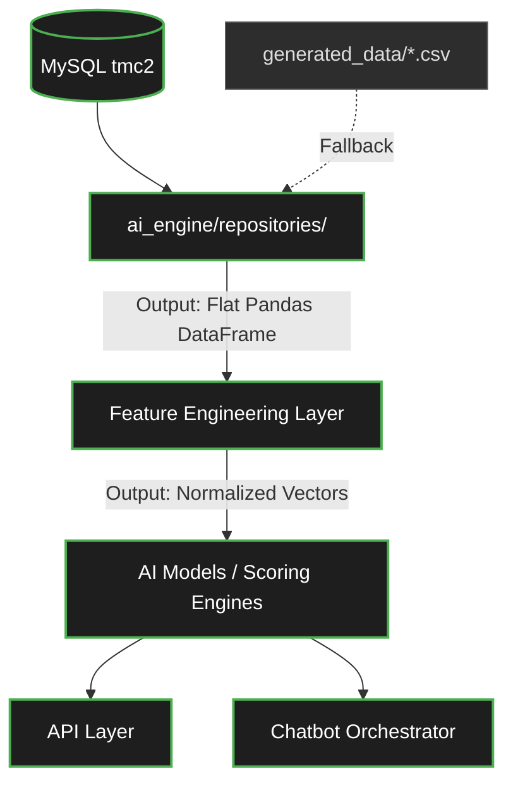

# PHASE 5 — SAFE INTEGRATION PLAN (DATA ACCESS ARCHITECTURE)

To protect the integrity of the AI models, we must insert a **Repository Layer** using the Adapter Pattern. The AI models must remain completely oblivious to the fact that the underlying data source has changed.

## Proposed Architecture

## Migration Strategy
1. The `AIServiceLayer` and `ChatbotOrchestrator` will stop calling `pd.read_csv()`.
2. They will instead instantiate `DataSourceFactory.get_repository('weather')`.
3. The repository will execute raw SQL or Django ORM queries using `db.backends.mysql`.
4. The repository will format the SQL results into the exact Pandas DataFrame format previously yielded by the CSV.
5. The Feature Engineering pipelines will execute identically.
