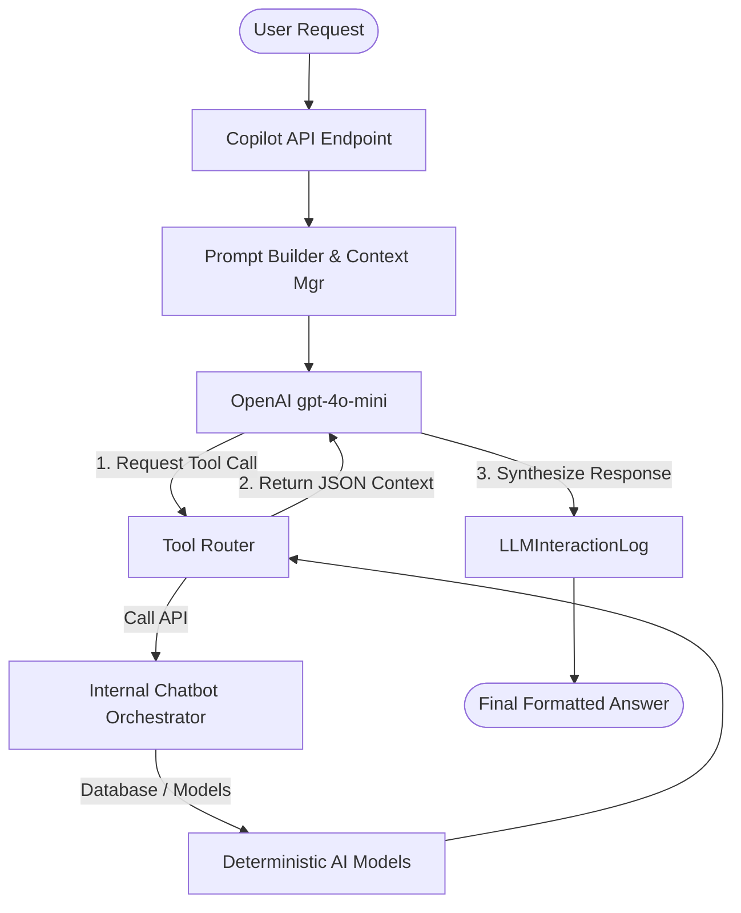

# OPENAI INTEGRATION ARCHITECTURE
**Version:** v1.0.0
**Role:** Conversational Reasoning & Explanation Layer

## 1. Core Principles
The OpenAI Copilot layer sits *on top* of the deterministic AI models (Ward Risk, Flood AI, etc.). It acts strictly as an orchestrator and synthesizer. 
**Crucial Constraint:** OpenAI is **never** permitted to calculate risk scores, alter probabilities, or invent resource allocations. It acts only on data retrieved via formal `Tool Calls` to the deterministic sub-engines.

## 2. Architecture Diagram

## 3. Key Components
1. **`LLMProvider` (ai_engine/llm/)**: A robust, abstract interface for `OpenAIProvider`. Integrates `tenacity` for exponential backoff retries.
2. **`ToolRouter` (ai_engine/copilot/)**: Exposes 5 strict JSON schemas representing the core AI modules. It maps LLM function calls directly to internal python API functions (`get_ward_status`, `get_city_summary`, etc.).
3. **`CopilotEngine`**: The central orchestrator. Maintains a rolling 5-turn session history in the Django cache.
4. **`LLMInteractionLog`**: A persistent PostgreSQL/MySQL log capturing `session_id`, `question`, `tools_called`, `token_usage`, and `response_time`.

## 4. Hallucination Prevention
To strictly prevent hallucinations, the Copilot utilizes a rigorous `SYSTEM_PROMPT` commanding the model to:
* Never invent facts.
* Use only JSON data explicitly returned by the tools.
* Preserve exact numerical values.
* If a question falls outside the returned data, fail gracefully: *"I do not have sufficient verified data to answer that."*
